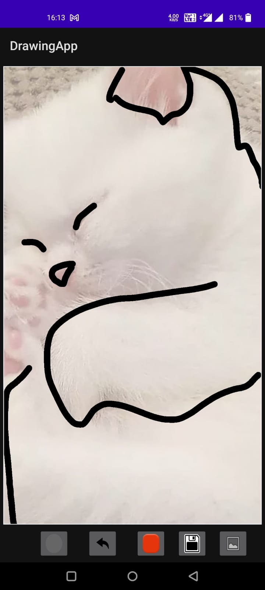
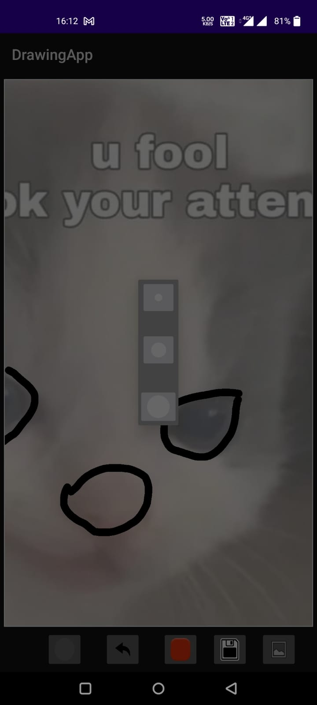
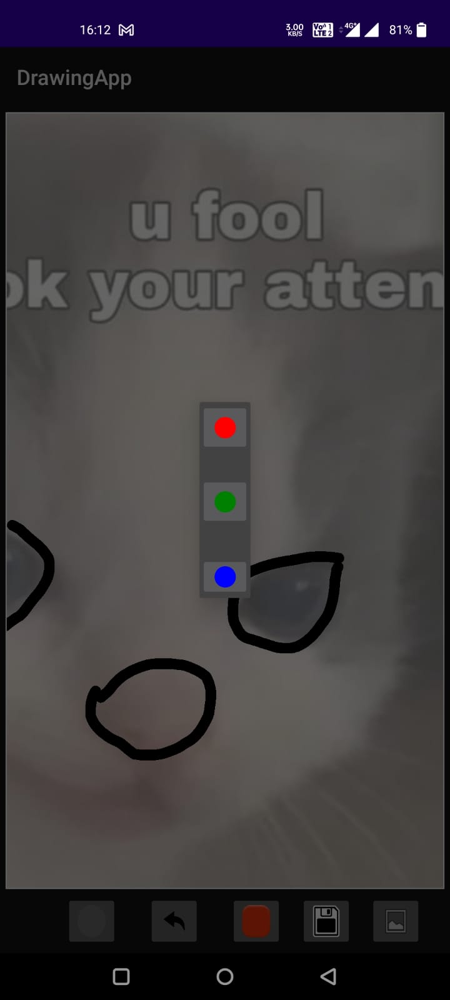
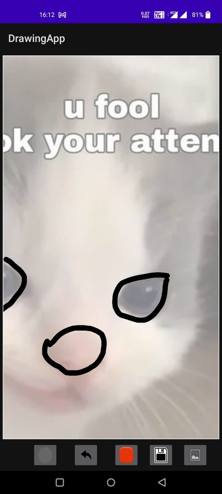

# DrawingApp
A simple drawing canvas app to take quick notes or for children to draw.

## Libs and Techniques

* [Kotlin](https://kotlinlang.org/)
* [Coolors](https://coolors.co) 
* [Android Studio](https://developer.android.com/docs)

## Screenshots:

Download the apk [here!](https://drive.google.com/file/d/1Wy2KO1wpap2zXn09fAI1N32dNG1Vylzl/view?usp=sharing)
